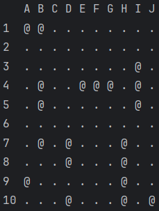
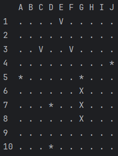

# Консольная игра "Морской бой" (Java)

## Описание

"Морской бой" — это классическая консольная игра, 
где два игрока сражаются на полях размером 10x10, размещая свои 
корабли и пытаясь уничтожить противника. Игроки поочередно делают 
выстрелы, вводя координаты, и получают информацию о попаданиях или 
промахах. Игра включает в себя алгоритмы для размещения кораблей, 
проверки состояния игры и вывода информации на экран.

## Режимы игры
- Человек-человек;
- Человек-компьютер;
- Компьютер.

## Режимы расстановки кораблей
- Автоматический;
- Ручной.

## Игровой процесс

### Подготовка к игре
- Игроки вводят свои имена. Имена для компьютеров задаются автоматически;
- Игроки выбирают режим расстановки кораблей (автоматический или ручной).
Для компьютеров используется автоматический режим расстановки.

### Ходы
- Игроки поочередно вводят координаты выстрела;
- В случае успешного попадания игрок ходит повторно;
- В консоль выводится состояние полей игроков и результат выстрела.

### Конец игры
- Конец игры наступает в случае, когда у одного из игроков не остается
непотопленных кораблей;
- При наступлении конца игры в консоль выводится имя победителя.

### Игровое поле

Обозначения:
- `.` — пустая клетка;
- `@` — клетка занята кораблем;
- `*` — "мимо", выстрел попал в пустую клетку;
- `V` — "ранен", выстрел уничтожил часть корабля;
- `X` — "убит", выстрел уничтожил весь корабль.

Пример поля игрока в начале игры:

Пример поля противника в процессе игры:

